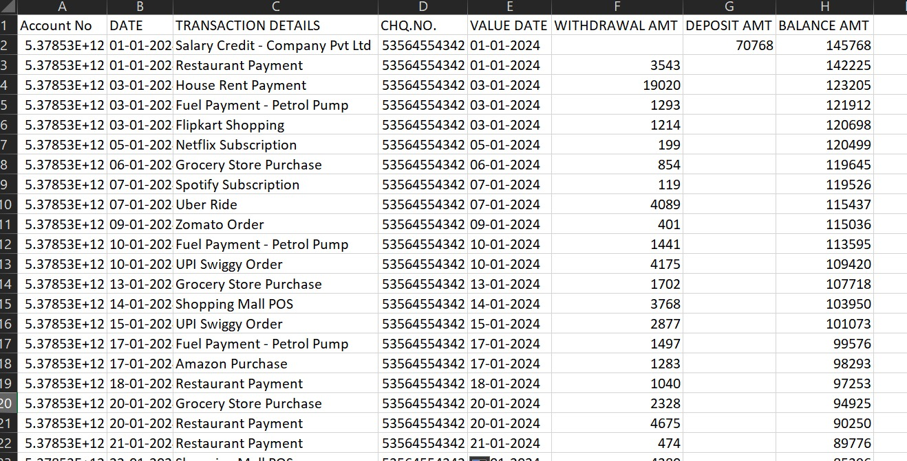
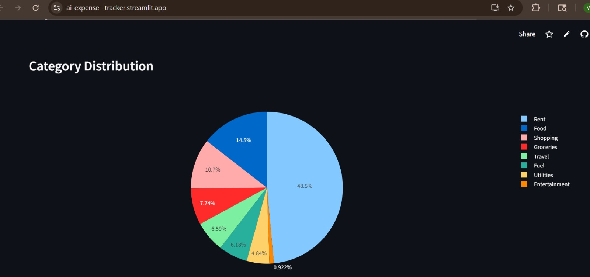
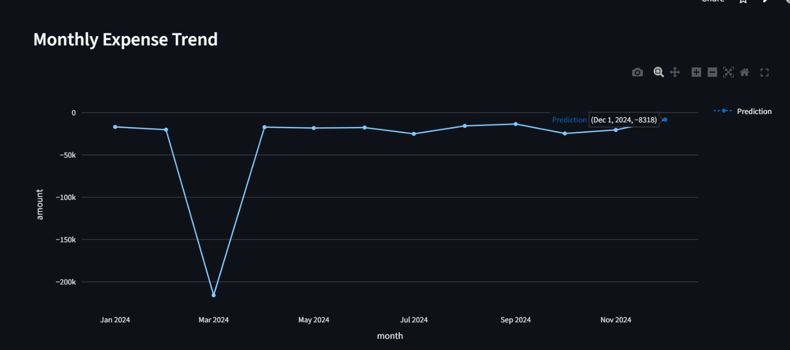

# AI Expense Intelligence System

## Overview

This project is an end-to-end intelligent expense analysis system that combines large language models with traditional machine learning to process raw bank transaction data, classify expenses, analyze spending patterns, and predict future expenses.

The system is designed to simulate a real-world fintech pipeline where transaction descriptions are unstructured and require semantic understanding before numerical modeling can be applied.

---
## Live Demo

- Application: https://ai-expense--tracker.streamlit.app/
- Repository: https://github.com/VivekMohape/ai-expense-tracker/tree/main
---
## Key Features

* Upload bank transaction data (Excel)
* Explore a built-in demo dataset with realistic one-year financial patterns
* Automatic transaction classification using a hybrid rule-based and LLM approach
* Monthly expense aggregation and trend analysis
* Future expense prediction using regression
* Interactive visualizations for insights

---

## Problem Statement

Bank transaction data is typically unstructured, especially in the transaction description field. Traditional rule-based systems struggle to classify such data reliably.

This project addresses two core challenges:

1. **Semantic Classification**
   Mapping noisy transaction descriptions (e.g., "UPI Swiggy Order", "POS AMAZON") into meaningful categories.

2. **Expense Forecasting**
   Predicting future spending patterns based on historical data.

---

## Solution Approach

The system is designed as a hybrid pipeline:

1. **Data Ingestion**

   * User uploads a dataset or selects a demo dataset

2. **Preprocessing**

   * Clean column names
   * Normalize transaction amounts
   * Convert dates to standard format

3. **Classification Layer**

   * Rule-based classification for high-confidence patterns
   * LLM fallback using Groq OpenAI OSS 120B model for ambiguous cases

4. **Data Storage**

   * Processed data stored in SQLite

5. **Aggregation**

   * Monthly expense grouping

6. **Prediction**

   * Linear regression model to forecast next month expenses

7. **Visualization**

   * Category-wise distribution (pie chart)
   * Monthly trends (line chart with prediction)

---

## Architecture

```
User Input (CSV / Excel or Demo Dataset)
        ↓
Data Cleaning and Transformation
        ↓
Hybrid Classification (Rules + LLM)
        ↓
SQLite Storage
        ↓
Monthly Aggregation
        ↓
Regression Model
        ↓
Visualization Dashboard (Streamlit)
```

---

## Technology Stack

| Layer           | Technology                       |
| --------------- | -------------------------------- |
| Frontend        | Streamlit                        |
| Backend         | Python                           |
| LLM             | Groq (OpenAI OSS 120B)           |
| Database        | SQLite                           |
| Data Processing | Pandas                           |
| ML Model        | scikit-learn (Linear Regression) |
| Visualization   | Plotly                           |

---

## Dataset

The project supports two modes:

### 1. User Upload

Users can upload their own bank transaction dataset in CSV or Excel format.

### 2. Demo Dataset

A one-year dataset is included, designed with realistic patterns:

* Monthly salary credits
* Recurring expenses (rent, subscriptions)
* Weekly spending (groceries, fuel)
* Random discretionary spending (shopping, dining)

This dataset enables meaningful time-series analysis and prediction.

---

## Project Structure

```
ai-expense-intelligence/
│
├── app.py
├── config.py
├── db.py
├── preprocess.py
├── llm_classifier.py
├── model.py
├── requirements.txt
│
├── sample_data/
│   └── 1yr_transactions.xlsx
│
└── README.md
```

## Usage

1. Select data source:

   * Upload your own file
   * Use demo dataset

2. Click "Run Analysis"

3. View:

   * Classified transactions
   * Category distribution
   * Monthly trends
   * Predicted next month expense

---

## Design Decisions

### Hybrid Classification (Rules + LLM)

* Rule-based logic handles predictable patterns (e.g., salary, rent)
* LLM handles ambiguous or unseen transaction descriptions
* Reduces cost and improves latency compared to full LLM usage

---

### Linear Regression for Prediction

* Chosen as a baseline model
* Simple and interpretable
* Suitable for demonstrating trend-based forecasting

Future versions can replace this with more advanced models.

---

### SQLite for Storage

* Lightweight and easy to integrate
* No external dependencies required

---

## Future Enhancements

* Replace regression with time-series models (e.g., Prophet)
* Batch LLM classification for performance optimization
* Add classification accuracy evaluation against labeled datasets
* Introduce anomaly detection for unusual spending
* Add user-level personalization and multi-account support
* Enable export of reports (PDF/CSV)
* Integrate real bank APIs for live data

---
## Evaluation

- Classification quality evaluated via manual inspection
- Prediction evaluated using trend consistency (baseline regression)
- Future improvement: add MAE / RMSE metrics
---
## Screenshots

### Upload and Data Preview


### Category Distribution


### Monthly Trend and Prediction


---
## AI Insights

The system generates intelligent insights based on historical spending patterns. These insights help users understand their financial behavior beyond raw visualizations.

### Sample Insights

- Highest spending category: Food
- Most expensive month: March
- Recurring fixed costs detected: Rent, Subscriptions
- Increasing trend observed in discretionary spending
- Predicted increase in next month's expenses

### Insight Types

- Category dominance (where most money is spent)
- Monthly trend analysis (spending increase/decrease)
- Recurring expense detection
- Forecast-based alerts (expected rise or drop)

---

## Key Insight

This project demonstrates a hybrid AI system:

* LLMs for semantic understanding
* Traditional ML for numerical prediction
---
## Production Architecture 

To scale this system into a production-grade application, the architecture would be redesigned by separating the frontend, backend, and processing layers.

Frontend (React / Web UI)
        ↓
FastAPI Backend (REST APIs)
        ↓
Service Layer
    ├── Preprocessing Service
    ├── Classification Service (LLM)
    ├── Prediction Service (ML)
    └── Insights Service
        ↓
Database Layer (BigQuery / MongoDB)

The Streamlit application would be replaced or complemented by a FastAPI backend exposing REST endpoints.

FastAPI Flow -->
User uploads file → /upload-transactions 
Backend: -->
Cleans data 
Stores raw transactions -->
/classify-transactions: 
Runs rule-based + LLM classification -->
/analytics/monthly:
Returns aggregated data -->
/prediction:
Returns forecast -->
/insights:
Returns generated insights 

# Security and Privacy Enhancements
## PII Masking
Mask account numbers and identifiers
Tokenization or hashing before storage
## Authentication
JWT-based authentication
Role-based access control
## Secure LLM Usage
Replace external APIs with local LLM
Prevent sensitive data leakage

## Guardrails and Validation
Restrict output categories to predefined set
Validate LLM responses
Add fallback rules for incorrect outputs

## Deployment Strategy
Backend: FastAPI (Dockerized)
Frontend: React / Next.js
Database: BigQuery or MongoDB
Orchestration: Kubernetes / Cloud Run
